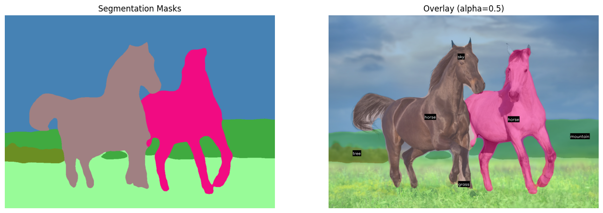
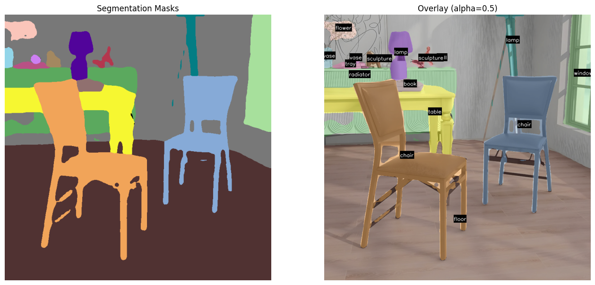

    <h1>Panoptic Segmentation using Mask2Former   in Hugging Face </h1>

 

---

## 🏗️ Methodology

- 🎨🖌️ Panoptic Segmentation Model1: **facebook/mask2former-swin-base-coco-panoptic**
- 🎨🖌️ App: **COCO categories**
- 🎨🖌️ Panoptic Segmentation Model2: **facebook/mask2former-swin-large-ade-panoptic** 
- 🎨🖌️ App: **ade20k**
- 🎨🖌️ Framework: **PyTorch + Hugging Face**

---

## ⭐ Acknowledgements

- Mask2Former powered by `Hugging Face`

---
